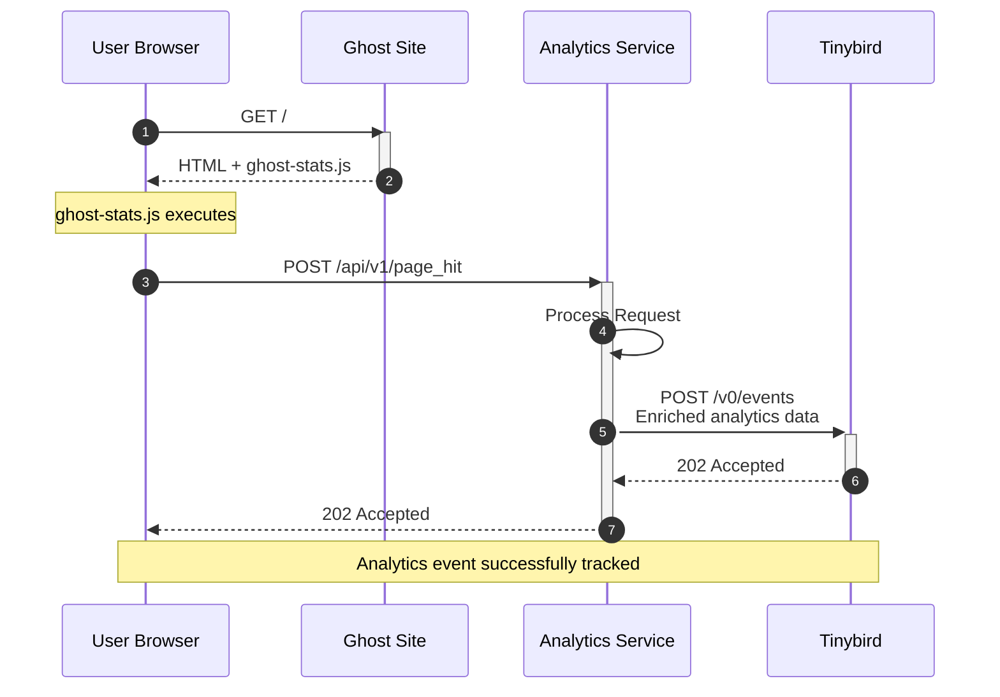

# Traffic Analytics

Traffic Analytics Service - A web analytics proxy for Ghost that processes and enriches traffic data before forwarding it to Tinybird's analytics API.

## How it Works
The following sequence diagram shows a simplified overview of where the Analytics Service fits in to Ghost's traffic analytics features.
1. A user requests a Ghost site's homepage (or any other page on the site's frontend)
2. Ghost serves the page's HTML, plus a script called `ghost-stats.js`
3. The `ghost-stats.js` script executes and sends a `POST` request to the Analytics Service's `POST /api/v1/page_hit` endpoint
4. The Analytics Service receives the request and processes it. This includes parsing the user agent, generating a user signature, etc.
5. The Analytics Service proxies the request to Tinybird
6. Tinybird receives the request and stores it in its Clickhouse database
7. The Analytics Service then proxies the response from Tinybird back to the user's browser.



## Features

- User agent parsing for OS, browser, and device detection
- Referrer URL parsing and categorization
- Privacy-preserving user signatures with daily-rotating salts

## Configuration

Copy `.env.example` to `.env` and configure as needed. For local development with Ghost, see [Develop locally with Ghost](#develop-locally-with-ghost)

## Develop

Pre-requisites:
- A container runtime, such as Docker Desktop or Orbstack
- Docker Compose

1. `git clone` this repo & `cd` into it as usual
2. `yarn dev` to build & start all required development services. The Analytics Service will be reachable at `http://localhost:3000`.

## Develop locally with Ghost

If you want to manually test the Analytics Service + Ghost together locally, there are just a few more steps to follow. You'll need this repo and TryGhost/Ghost cloned locally.

1. In Ghost, add `ANALYTICS_PROXY_TARGET=traffic-analytics-analytics-service-1:3000` to your `.env` file. This tells Ghost's `caddy` service to route requests to `/.ghost/analytics/**` to this instance of the analytics service instead of the instance in Ghost's compose project.
1. In Ghost, run `docker compose --profile analytics up -d`. This starts `tinybird-local`, deploys the Tinybird schema, and stored required tokens in a `shared-config` named volume.
1. In Ghost, run `docker compose --profile split up`. This runs Caddy, Ghost's backend and Ghost Admin. Ghost will be available at `http://localhost:2368`
1. In this repo, run `yarn dev:ghost` instead of `yarn dev`. This runs the analytics service within Ghost's docker network, and mounts the `shared-config` volume so it can access the tokens it needs to send events to `tinybird-local`.

That's it! Now when you visit Ghost at `http://localhost:2368`, you should see the requests to `/.ghost/analytics/api/v1/page_hit` in the request logs in this repo, and the `worker` service will send the events to the `tinybird-local` service running in the Ghost project.

## Test

- `yarn test:types` — run Typescript typechecks in Docker
- `yarn test:unit` — run all unit tests in Docker
- `yarn test:integration` — run all integration tests in Docker
- `yarn test` — run typechecks, unit tests and integration tests in Docker
- `yarn test:e2e` — run e2e tests (with wiremock) in Docker

## Lint
- `yarn lint` run eslint in docker compose


## Multi-Worktree Development

This project supports running multiple worktrees simultaneously using Docker Compose. Each worktree can run its own isolated development environment with unique ports and container names.

### Setup

1. **Create worktrees** as usual with git worktree
2. **Configure each worktree** with a unique `.env` file:

```bash
# main worktree (.env) - uses defaults
NODE_ENV=development

# work worktree (.env)  
NODE_ENV=development
COMPOSE_PROJECT_NAME=traffic-analytics-work
ANALYTICS_PORT=3001
FIRESTORE_PORT=8081

# scratch worktree (.env)
NODE_ENV=development  
COMPOSE_PROJECT_NAME=traffic-analytics-scratch
ANALYTICS_PORT=3002
FIRESTORE_PORT=8082
```

### Usage

Each worktree runs completely isolated:
- **Unique ports**: No conflicts between worktrees
- **Isolated containers**: Auto-generated names like `traffic-analytics-work-analytics-service-1`
- **Separate volumes**: Each worktree has its own `node_modules` volume
- **Independent projects**: Services can run simultaneously

```bash
# Start development in any worktree
cd /path/to/worktree
docker compose up

# Each worktree accessible on its configured port
# main: http://localhost:3000
# work: http://localhost:3001  
# scratch: http://localhost:3002
```

## Deployment

Merging to `main` automatically deploys to staging. Production deployments only happen when the version in `package.json` changes.

To ship to production:
1. `yarn ship` - creates a release branch with version bump
2. Create PR using the provided link
3. Merge the PR - this triggers production deployment

# Copyright & License 

Copyright (c) 2013-2025 Ghost Foundation - Released under the [MIT license](LICENSE).
